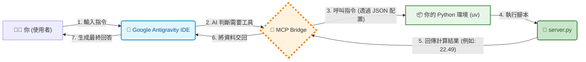

# Hello World MCP Server - BMI Calculator

這是一個基於 Python 與 [Model Context Protocol (MCP)](https://modelcontextprotocol.io/) 的入門範例專案。

本專案展示了如何使用 Python 的 `mcp` SDK (FastMCP) 建立一個簡單的伺服器，並將其連接到支援 MCP 的 AI 客戶端（如 **Google Antigravity**、**Claude Desktop** 或 **Cursor**），賦予 AI 計算 BMI 的能力。




## 🚀 專案功能

- **核心功能**：提供一個名為 `calculate_bmi` 的工具。
- **輸入參數**：身高 (cm)、體重 (kg)。
- **輸出結果**：計算後的 BMI 數值與格式化訊息。
- **技術堆疊**：Python 3.10+, `uv` (套件管理器), `mcp` SDK。

## 🛠️ 前置準備

在開始之前，請確保你的系統已安裝以下工具：

1. **Python** (建議 3.10 以上)
2. **uv** (極速 Python 套件管理器)
    - Windows 安裝指令: `powershell -c "irm https://astral.sh/uv/install.ps1 | iex"`
    - Mac/Linux 安裝指令: `curl -LsSf https://astral.sh/uv/install.sh | sh`

## 📦 安裝與建置

1. **初始化專案環境**

    ```bash
    uv init hello-mcp-server
    cd hello-mcp-server
    ```

2. **安裝 MCP 依賴套件**

    ```bash
    uv add "mcp[cli]"
    ```

3. **建立伺服器程式碼**

    建立 `server.py` 並貼上以下程式碼：

    ```python
    from mcp.server.fastmcp import FastMCP

    mcp = FastMCP("Hello World BMI")

    @mcp.tool()
    def calculate_bmi(height_cm: float, weight_kg: float) -> str:
        """
        計算 BMI 的工具。
        
        Args:
            height_cm: 身高 (公分)
            weight_kg: 體重 (公斤)
        """
        height_m = height_cm / 100
        bmi = weight_kg / (height_m ** 2)
        return f"你的 BMI 是 {bmi:.2f}"

    if __name__ == "__main__":
        mcp.run()
    ```

## 🐞 測試與除錯 (MCP Inspector)

在連接到 AI 之前，可以使用 MCP Inspector 進行網頁視覺化測試：

```bash
uv run mcp dev server.py
```

執行後，瀏覽器會自動開啟 http://localhost:5173。
你可以在介面上選取 `calculate_bmi` 工具進行測試。

## 🔌 連接至 AI (Antigravity / Claude)

要讓 AI 使用此工具，需修改 MCP 設定檔 (`claude_desktop_config.json` 或 IDE 的 MCP 設定)。

### 設定檔範例 (Windows 環境)

請將路徑修改為你實際的檔案位置。

```json
{
  "mcpServers": {
    "hello-bmi": {
      "command": "C:\\Users\\User\\.local\\bin\\uv.exe",
      "args": [
        "run",
        "--with",
        "mcp[cli]",
        "C:\\Users\\User\\Desktop\\Code\\hello_world_mcp\\server.py"
      ]
    }
  }
}
```

> **注意**：JSON 格式中的 Windows 路徑需使用雙斜線 `\\`。

## 💬 使用範例

設定完成並重啟 IDE 後，你可以直接對 AI 下達自然語言指令：

> **User**: 「幫我算一下 BMI，我身高 175 公分，體重 70 公斤。」
>
> **AI**: (自動呼叫 Python Tool) 「根據計算，你的 BMI 是 22.86。」

## 📂 專案結構

```text
hello-world-mcp/
├── .venv/              # uv 建立的虛擬環境
├── pyproject.toml      # 專案依賴設定檔
├── uv.lock             # 版本鎖定檔
├── server.py           # MCP Server 主程式
└── README.md           # 專案說明文件
```